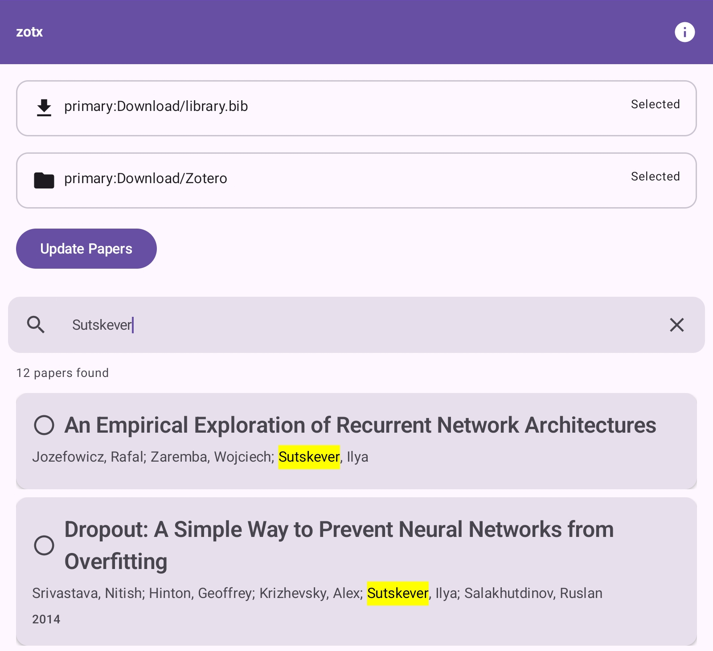

# ZotX

With my [Zotero](https://www.zotero.org/) setup, all my PDFs are managed as attachments via [ZotMoov](https://github.com/wileyyugioh/zotmoov). The Zotero library itself doesn't hold a single PDF. Instead, it links to the PDFs stored in a folder on my computer. I organize and read in Zotero, and sometimes take notes in [Obsidian](https://obsidian.md), linking everything together with [BetterBibTeX](https://retorque.re/zotero-better-bibtex/).

**What about integrating that with Android?** Moving/Syncing PDFs to your Android device is quickly done, but then also knowing which file contains which paper, and wether you already read it or not, isn't. **ZotX** solves that.

## Quick Start

1. **In Zotero:** Export your library as a BetterBibTeX `.bib` file
   *(Library > Export > BetterBibTeX)*
2. Sync the PDFs and the `.bib` file to your Android device
3. **In ZotX:** Select the `.bib` file
4. **In ZotX:** Select the folder containing your PDFs
5. **Browse:** See your list of papers, with context from your Zotero library, search through them and open them to read on Android with your preferred PDF reader

<p align="center">
  
</p>

## Usage

ZotX is dual-licensed for accessibility to individual users and researchers with specific terms for commercial use. This ensures that ZotX remains freely available for individuals while providing an option to fund development.

### Personal and Research Use

You are free to use, modify, and share ZotX for personal, academic, or non-commercial research purposes under the [Creative Commons Attribution-NonCommercial-ShareAlike 4.0 International (CC BY-NC-SA 4.0)](LICENSE_INDIVIDUAL) license.

### Commercial Use

Commercial use of ZotX is subject to specific conditions:
- If your organization has less than $100 thousand USD in gross annual revenue (or equivalent, over the course of the last 12 months) and has raised less than $100 thousand USD in total funding (or equivalent, total raised), you may use ZotX under the [Creative Commons Attribution-NonCommercial-ShareAlike 4.0 International (CC BY-NC-SA 4.0)](LICENSE_INDIVIDUAL) license.
- If your organization exceeds these thresholds, contact me at [mk2112@protonmail.com](mailto:mk2112@protonmail.com) to discuss a licensing agreement.

## Requirements

- Android 8.0+
- Zotero with BetterBibTeX and ZotMoov
- Any file sync app (e.g. [Syncthing](https://syncthing.net/))
- Any PDF reader app on Android

## Development

- OpenJDK 21
- Gradle 8.14

```bash
git clone https://github.com/MK2112/zotx.git
cd zotx
./gradlew clean build
```

## Related

- [Zotero](https://www.zotero.org/) — Reference manager
- [Better BibTeX](https://retorque.re/zotero-better-bibtex/) — BibTeX export plugin
- [ZotMoov](https://github.com/wileyyugioh/zotmoov) — Attachment linker
